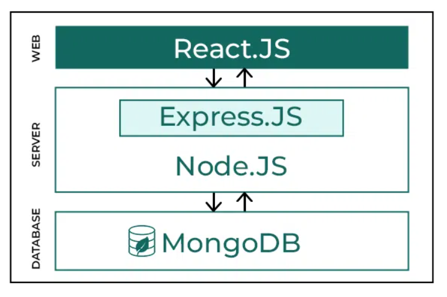
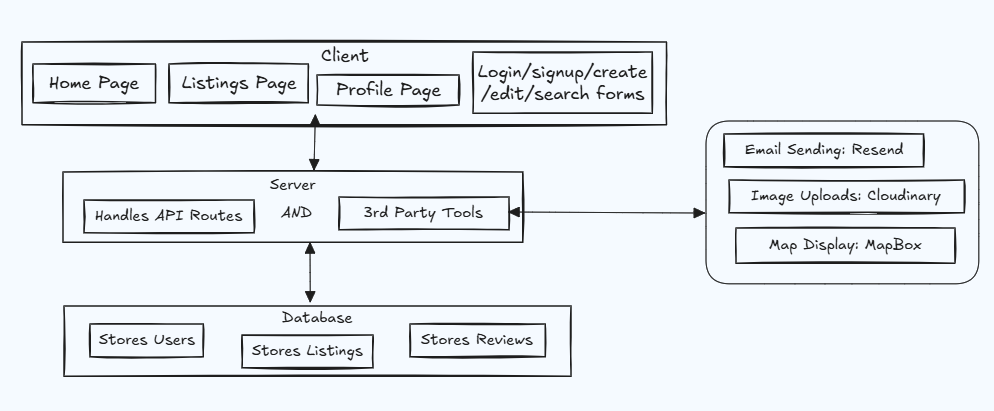

<div align="center">
<h1>🏡 TripGo - Real Estate MERN App</h1>

<b >A full-stack real estate web application built with the MERN stack. TripGo allows users to explore properties, create listings, post reviews, and manage their accounts—all wrapped secure, responsive and professional UI.</b>

</div>

<div align="center">
  <br />
      
      
      
      
      
  <br />
</div>

---

**All Demo Links (Map, Email, Review Analysis)** : https://html-temp-blond.vercel.app/

## 🛠️ Tech Stack

- Frontend: React, Tailwind CSS, Context API, React Router v6, lucide React icons, react toastify, formik + yup
- Backend: Node.js, Express.js, MongoDB, Mongoose, Hoppscotch
- Authentication: Passport.js (session based), Google OAuth2.0
- Image Management: Cloudinary + Multer
- Email Service: Resend (local testing)
- Maps: Mapbox
- NLP integration for Review Analysis: Natural.js
- Deployment - Frontend (Static Site) and Backend (Web Services) both Deployed on Render

## 🧠 Architecture & Flow

This project follows a **client-server architecture** where the Data Flow Looks like this:

- The client sends API requests (e.g., new listing creation).

- Server processes them, interacts with the database or third-party service.

- Response is returned and displayed on the frontend.

<div align="center">
  <div>
    
    
    <p align="center"> fig: Explaining TripGO's Architecture using general MERN Arch as Reference</p>
  </div>
</div>

## ✨ Frontend Notable and Best Practices

- **Thoughtful Design Decisions**

  - Full form view on large screens (no scrolling) for enhanced UX
  - Category icons inspired by Airbnb's design for familiarity and aesthetics
  - Consistent layout using a central `MainScreen` wrapper
  - Added Subtle Animations to enhance UX
  - implemented Review Sentimental Analysis Sytem so that `users can take data driven decision` and opt for the best suitable Listing

- **Complete User Dashboard**

  - Full CRUD functionality for user accounts, listings, and reviews
  - Editable user profiles including profile photo and personal info

- **Advanced UI Components**

  - Built reusable and logic-heavy components like `StarRatingIcon` , `filter side drawers`, `skeleton loaders`, `confirmation, edit, delete modals`
  - Professionally designed multi-field forms for listing creation/editing with validation and responsive layout
  - Ref-based focus/blur handling for modals and options (e.g. `useRef` on image previews, user dropdowns)

- **Performance Optimization Techniques**

  - Implemented **lazy loading** to defer the loading of expensive components using `IntersectionObserver` to minimize `Time To Interactive (TTI)`
  - Took a `Architectually Sound Decison` and isolated `non-critical feature` instead of writing the 3 heavy components in just one file and made them access of user toggles
  - Applied cleanup using `URL.revokeObjectURL` and observer disconnection to `avoid memory leaks`
  - Utilized `IntersectionObserver`, `AbortController`, and `URL.createObjectURL` for precise and performant UX behavior

- **Routing & Authentication**

  - Role-based **protected routes**
  - Graceful `fallback pages` for 404 errors and empty states. Also Added Spinner and loaders while data fetch

- **State & Logic Sharing**
  - Managed Logic Sharing across components using **React Context API** and custom hooks
  - Applied `hook-based modular structure` for logic separation

## 🧩 Backend Notable Features and Best Practices

- **Authentication & Security**

  - Integrated **Passport.js** for session-based authentication Implemented **Google OAuth 2.0** Auth strategy
  - Protected API endpoints from unauthorized access and manual testing via tools like Postman, Hoppscotch
  - Employed `Rate-limiter` on Api to restrict spam, brute-force attacks, and bot signups
  - `Password Encryption` - Hashing and salting passwords before storing them in the database

- **Session Management**

  - Handled persistent login sessions using cookies and secure headers
  - Ensured cross-origin cookie support with proper CORS settings

- **Robust API Design**

  - RESTful API routes for Listings, Users, Reviews, and Auth
  - Applied structured and consistent response formats

- **Input Validation**

  - Dual-layer validation (frontend + backend) to ensure data integrity
  - Sanitized and verified all user inputs before DB interaction

- **Scalable Architecture**

  - `Modular route structure` with middleware separation (auth, validation, file upload, error handler)
  - Mongoose models with references and schema-level validation
  - implemented one to many and many to one relations using `mongoose.populate`

- **Cloud Services Integration**

  - Used **Cloudinary** for secure and scalable image hosting
  - Handled file uploads with **Multer** middleware
  - Integrated **Resend** email API for sending verification (local testing only)

---

### Areas where i struggled:

- Reducing the load times of components involves heavy backend Processings
- Sending files type and multi-field data to the backend via formik
- Implementing Session based Auth and Writing mongo queries
- Handling the API responses ( API errors + Data logic errors) etc.
- Preventing spam account creation using
- OAuth working only locally
- Preventing cloud storage abuse by enforcing limits on uploaded images both from the client and backend

---

### if given more time i would :

- Add Owner Contact and Chat Feature webSockets
- Listing Copy Link to share listings
- Redux State Management
- JWT based Auth
- Dark Mode Theme Data Persistance even after network down or reloads
- Follow More Best Practices

## 🤸 Quick Start :-

Follow these steps to set up the project locally on your machine.

**Prerequisites**

Make sure you have the following installed on your machine:

- [Git](https://git-scm.com/)
- [npm](https://www.npmjs.com/) (Node Package Manager)

**Cloning the Repository**

Open command prompt -> type 'cd desktop' ->

```bash
git clone https://github.com/Rukhsarkh/TripGo-MERN-Real-Estate.git
```

close command prompt -> open the created folder in code editor AND run just 2 commands :-

## Frontend installation

First Of All, Make a .env file in Client directory, Copy-paste the env from .env.exmaple and populate your ENVs or you can simply remove .exmaple extension

Then install the project dependencies using npm

```bash
cd client
npm install
```

## Running

Running the project

```bash
npm run dev
```

---

## Backend installation

First Of All, Make a .env file in Server directory, Copy-paste the env from .env.exmaple and populate your ENVs or you can simply remove .exmaple extension

Then, split the terminal or open separate terminal, install the backend project dependencies using npm

```bash
cd ..
cd server
npm install
```

## Running

Running the project

```bash
npm start
```

See in terminal - when server running at : PORT, mongodb connected message get consoled then click on the frontend url from first terminal

Voila 🎉 have a look into your browser !
