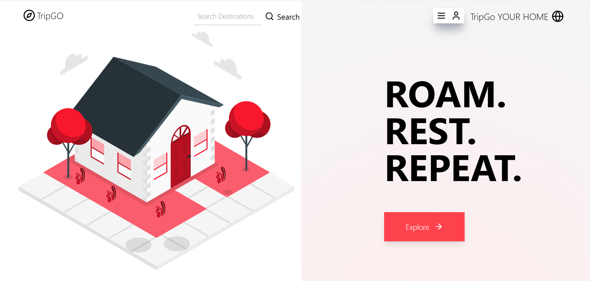
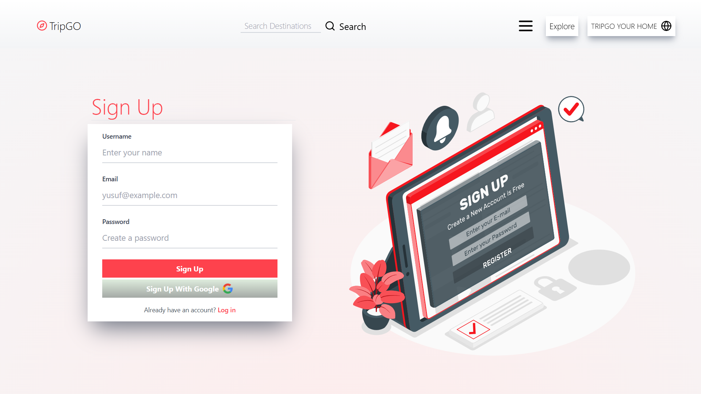
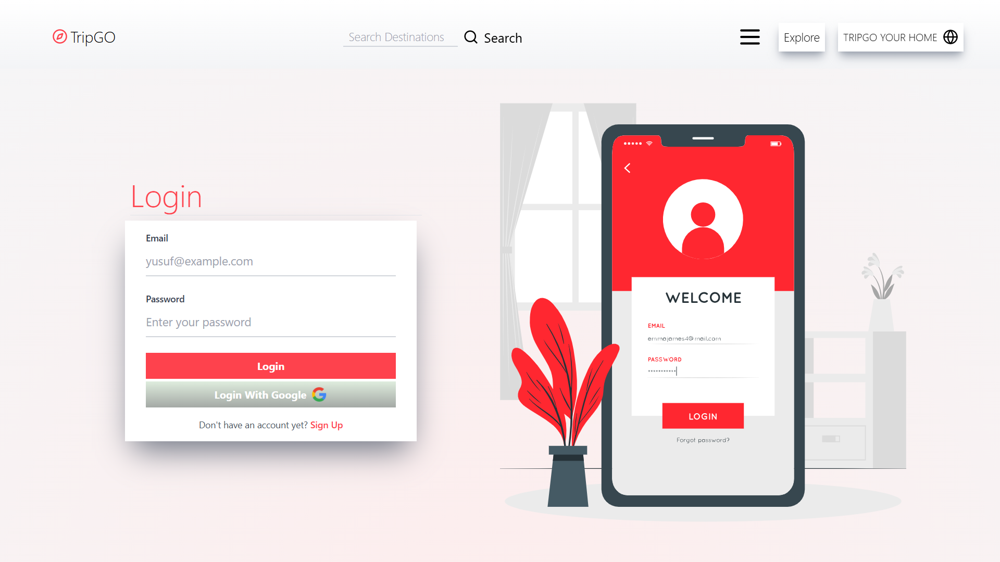
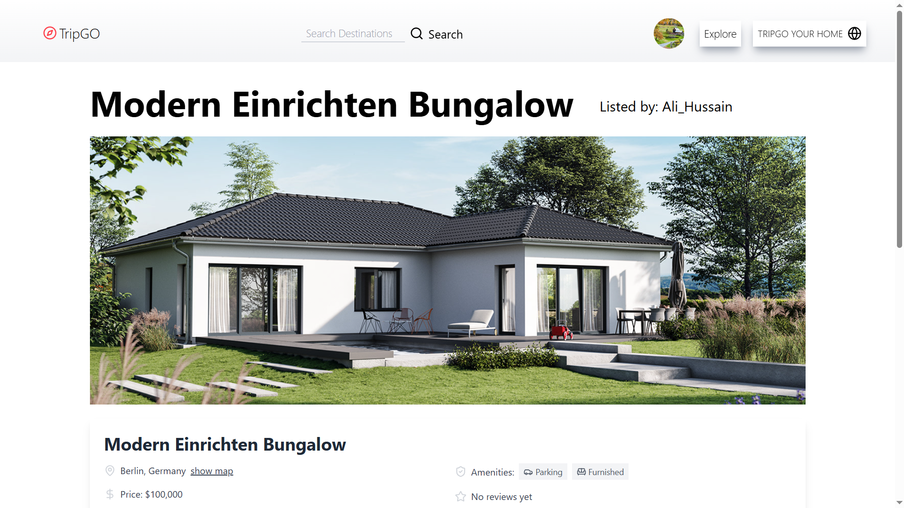

<div align="center">
<h1>🏡 TripGo - Real Estate MERN App</h1>

<b >A full-stack real estate web application built with the MERN stack. TripGo allows users to explore properties, create listings, post reviews, and manage their accounts—all wrapped in a fast, responsive, and professional UI.</b>

</div>

<div align="center">
  <br />
      
      
      
      
      
  <br />
</div>

---

## 🛠️ Tech Stack

- Frontend: React, Tailwind CSS, Context API, React Router v6, lucide React icons, react toastify, formik + yup
- Backend: Node.js, Express.js, MongoDB, Mongoose, Hoppscotch
- Authentication: Passport.js (session based), Google OAuth2.0
- Image Management: Cloudinary + Multer
- Email Service: Resend (local testing)
- Maps: Mapbox
- NLP integration for Review Analysis: Natural.js
- Deployment - Frontend (Static Site) and Backend (Web Services) both Deployed on Render

## 🤸 Quick Start :-

Follow these steps to set up the project locally on your machine.

**Prerequisites**

Make sure you have the following installed on your machine:

- [Git](https://git-scm.com/)
- [npm](https://www.npmjs.com/) (Node Package Manager)

**Cloning the Repository**

Open command prompt -> type 'cd desktop' ->

```bash
git clone https://github.com/Rukhsarkh/TripGo-MERN-Real-Estate.git
```

close command prompt -> open the created folder in code editor AND run just 2 commands :-

## Frontend installation

First Of All, Make a .env file in Client directory and put these :

- VITE_API_URL=YOUR DEPLOYED BACKEND URL
- VITE_PROD=development FOR LOCAL and VITE_PROD=production while deploying frontend
- VITE_MAPBOX_API=YOUR MAPBOX API KEY AFTER MAKING ACCOUNT ON MAPBOX

Then install the project dependencies using npm

```bash
cd client
npm install
```

## Running

Running the project

```bash
npm run dev
```

## Backend installation

First Of All, Make a .env file in Server directory and put these :

- PORT=WHATVER_PORT_YOUR_SERVER_IS_RUNNING
- MONGO_URI=MAKE MONGO URI FROM MONGODB CLOUD ACCOUNT
- CLOUD_NAME=YOUR CLOUDINARY NAME AFTER SIGNING IN
- CLOUD_KEY=YOUR CLOUDINARY KEY
- CLOUD_SECRET=CLOUDINARY SECRET
- RESEND_API_KEY=RESEND API KEY AVAILABLE LOCAL DEVELOPMENT ONLY
- COMPANY_LOGO_URL=TAKE ANY PHOTO THIS WILL BE ATTACHED TO EMAIL
- FROM_EMAIL=onboarding@resend.dev (KEEP IT AS IT IS_THEY PROVIDE IT FOR TESTING)
- FRONTEND_URL=http://localhost:5173 (FOR LOCAL DEVELOPMENT) BUT PUT YOUR DEPLOYED FRONTEND URL WHILE DEPLOYTINH BACKEND
- COOKIE_SECRET_CODE=CAN KEEP ANYTHING OF YOUR OWN
- SESSION_SECRET_CODE=CAN KEEP ANYTHING OF YOUR OWN
- NODE_ENV=production - this is developement in local while production in prod
- MAP_TOKEN=YOUR MAPBOX API SAME AS FRONTEND
- GOOGLE_CLIENT_ID=YOUR GOOGLE CLIENT ID AFTER MAKING PROJECT FOR THIS PROJECT THERE
- GOOGLE_CLIENT_SECRET=YOU WILL ALSO GET GOOGLE CLIENT SECRET
- GOOGLE_CALLBACK_URL=http://localhost:YOUR_PORT/auth/google/callback - # this will change to https://DEPLOYED_BACKEND_URL/auth/google/callback in production

Then, split the terminal or open separate terminal, install the backend project dependencies using npm

```bash
cd ..
cd server
npm install
```

## Running

Running the project

```bash
npm start
```

See in terminal - when server running at : PORT, mongodb connected message get consoled then click on the frontend url from first terminal

Voila ! have a look into your browser !

## ✨ Frontend Notable Features

- **Thoughtful Design Decisions**

  - Full form view on large screens (no scrolling) for enhanced UX
  - Category icons inspired by Airbnb's design for familiarity and aesthetics
  - Consistent layout using a central `MainScreen` wrapper
  - Added Subtle Animations to engage user

- **Complete User Dashboard**

  - Full CRUD functionality for user accounts, listings, and reviews
  - Editable user profiles including profile photo and personal info

- **Advanced UI Components**

  - Built reusable and logic-heavy components like `StarRatingIcon` , `filter side drawers`, `skeleton loaders`, `confirmation, edit, delete modals`
  - Professionally designed multi-field forms for listing creation/editing with validation and responsive layout
  - Ref-based focus/blur handling for modals and options (e.g. `useRef` on image previews, user dropdowns)

- **Performance Optimization Techniques**

  - Implemented **lazy loading** to defer the loading of expensive components using `IntersectionObserver` to minimize **Time To Interactive (TTI)**
  - Took a `Architectually Sound Decison` and isolated non-critical feature instead of writing the 3 heavy components in just one file and made them access of user toggles
  - Applied cleanup using `URL.revokeObjectURL` and observer disconnection to `avoid memory leaks`
  - Utilized `IntersectionObserver`, `AbortController`, and `URL.createObjectURL` for precise and performant UX behavior

- **Routing & Authentication**

  - Role-based **protected routes**
  - Graceful fallback pages for 404 errors and empty states. Also Added Spinner and loaders while data fetch

- **State & Logic Sharing**
  - Managed Logic Sharing across components using **React Context API** and custom hooks
  - Applied hook-based modular structure for logic separation

## 🧩 Backend Notable Features

- **Authentication & Security**

  - Integrated **Passport.js** for session-based authentication Implemented **Google OAuth 2.0** Auth strategy
  - Protected API endpoints from unauthorized access and manual testing via tools like Postman, Hoppscotch
  - Employed `Rate-limiter` on Api to restrict spam, brute-force attacks, and bot signups.

- **Session Management**

  - Handled persistent login sessions using cookies and secure headers
  - Ensured cross-origin cookie support with proper CORS settings

- **Robust API Design**

  - RESTful API routes for Listings, Users, Reviews, and Auth
  - Applied structured and consistent response formats

- **Input Validation**

  - Dual-layer validation (frontend + backend) to ensure data integrity
  - Sanitized and verified all user inputs before DB interaction

- **Scalable Architecture**

  - Modular route structure with middleware separation (auth, validation, file upload, error handler)
  - Mongoose models with references and schema-level validation

- **Cloud Services Integration**

  - Used **Cloudinary** for secure and scalable image hosting
  - Handled file uploads with **Multer** middleware
  - Integrated **Resend** email API for sending verification (local testing only)

### Areas where i struggled

- Sending files type and multi-field data to the backend via formik
- Implementing Session based Auth and Writing mongo queries
- Handling the API responses ( API errors + Data logic errors)
- Designing Landing Page For how to make it follow minimalism

### if given more time i would :

- Add Owner Contact and Chat Feature
- Listing Copy Link to share listings
- Redux State Management
- JWT based Auth
- Modularize Code
- Follow Best Practices
